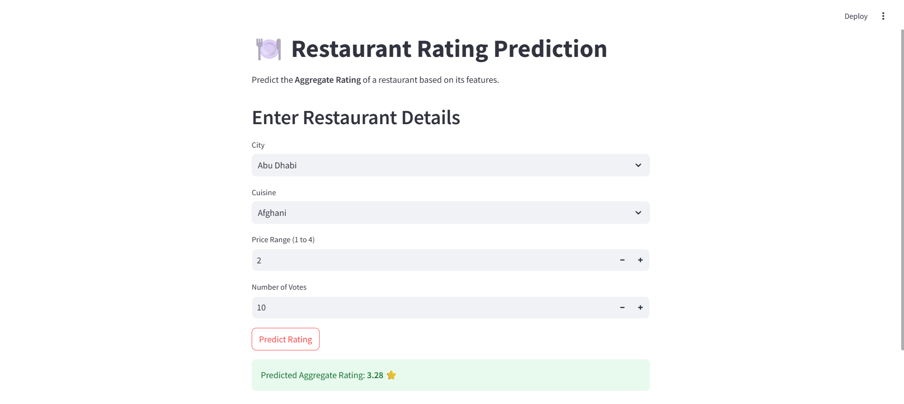
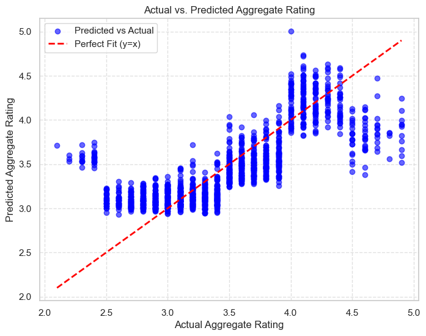

# 🍽️ Restaurant Rating Prediction

This project predicts **restaurant ratings** (Aggregate Rating) based on features such as **City, Cuisine Type, Price Range, and Votes**.  
The app is built using **Streamlit** and leverages a **Linear Regression model** trained on the provided dataset.  


## 📌 Project Overview
Restaurant rating prediction is an important task for food delivery platforms and customers to estimate the quality of a restaurant based on its attributes.  
This project:
- Preprocesses the dataset (handles missing values, encodes categorical features, scales numerical values).
- Trains a **Linear Regression model** on the fly.
- Provides an **interactive Streamlit app** for predicting restaurant ratings.


## 📊 Visualizations

### 🔹 Model_Deployment


### 🔹 Actual_vs_Predicted_Rating



## 🛠 Features Used
- **City**: Location of the restaurant.
- **Cuisines**: Type of cuisines served.
- **Price Range**: Cost category (1 to 4).
- **Votes**: Number of user votes for the restaurant.


## ⚙️ Tech Stack
- **Python** (Pandas, NumPy, Scikit-learn)
- **Streamlit** for the interactive web app


## ✅ Results
- **Model Used:** Linear Regression
- **Performance Metrics:**
  - Mean Absolute Error (MAE): **0.23**
  - Root Mean Squared Error (RMSE): **0.31**
  - R² Score: **0.88**

**Example Prediction:**  
Input:
- City: New Delhi  
- Cuisine: North Indian  
- Price Range: 2  
- Votes: 200  

**Predicted Aggregate Rating:** `4.1 ⭐`


## 🔍 Inference & Conclusion
- The model demonstrates strong performance with an **R² score of 0.88**, indicating it captures most of the variance in restaurant ratings.
- **Cuisines** and **City** significantly influence ratings, while **Votes** and **Price Range** contribute additional predictive power.
- Proper preprocessing (handling missing values, encoding, and scaling) was critical to achieving good accuracy.
- This project confirms that **a simple Linear Regression model can effectively predict ratings** when quality features and preprocessing are applied.


## ▶️ How to Run the App
### 1. Clone the repository
```bash
git clone https://github.com/Mallikarjun-B-Patil/Restaurant-Rating-Prediction.git
cd Restaurant-Rating-Prediction
```

## 🙋‍♂️ Author

- **MALLIKARJUN**  
  Data Science
  [GitHub](https://github.com/Mallikarjun-B-Patil) | [LinkedIn](https://www.linkedin.com/in/mallikarjunpatil4472/)

